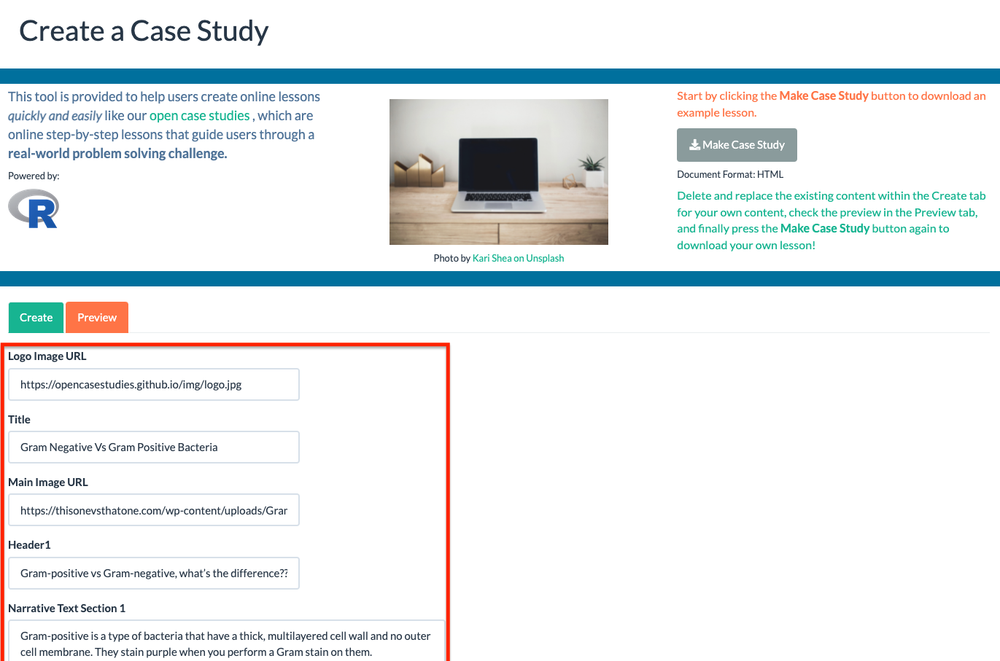
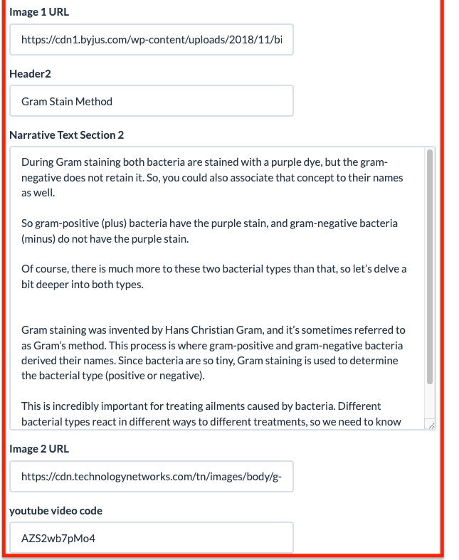
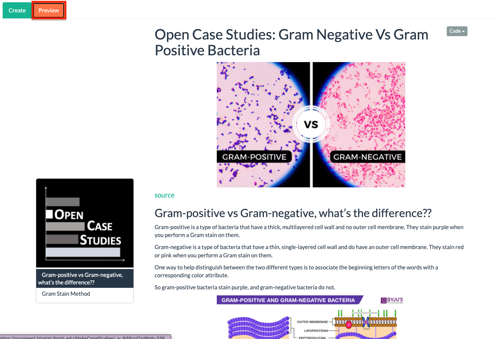
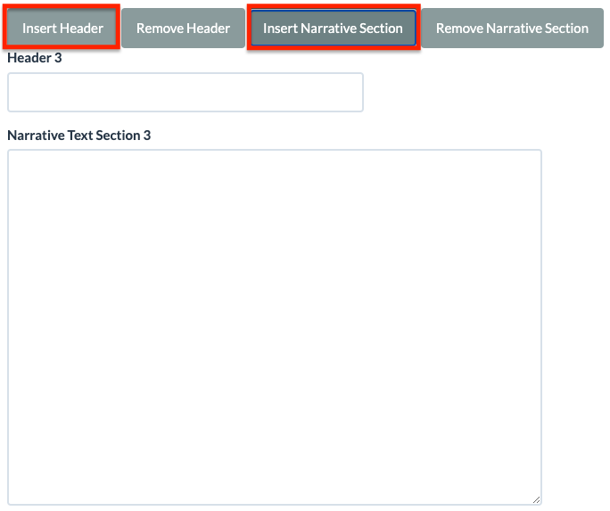
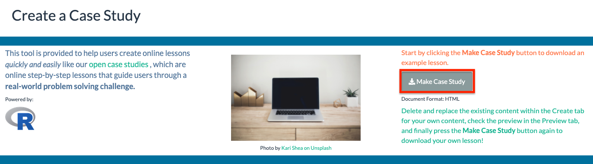
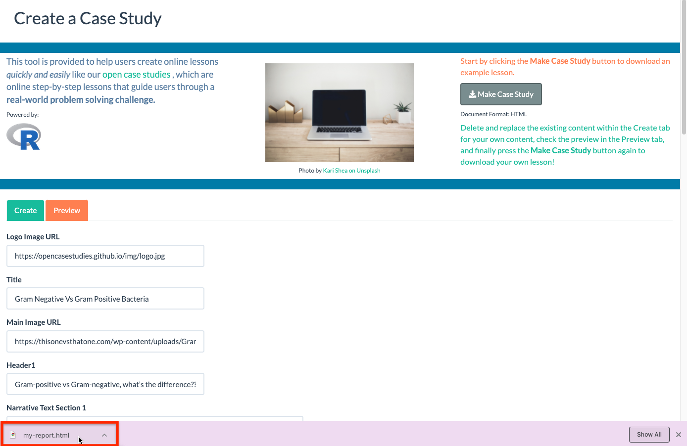
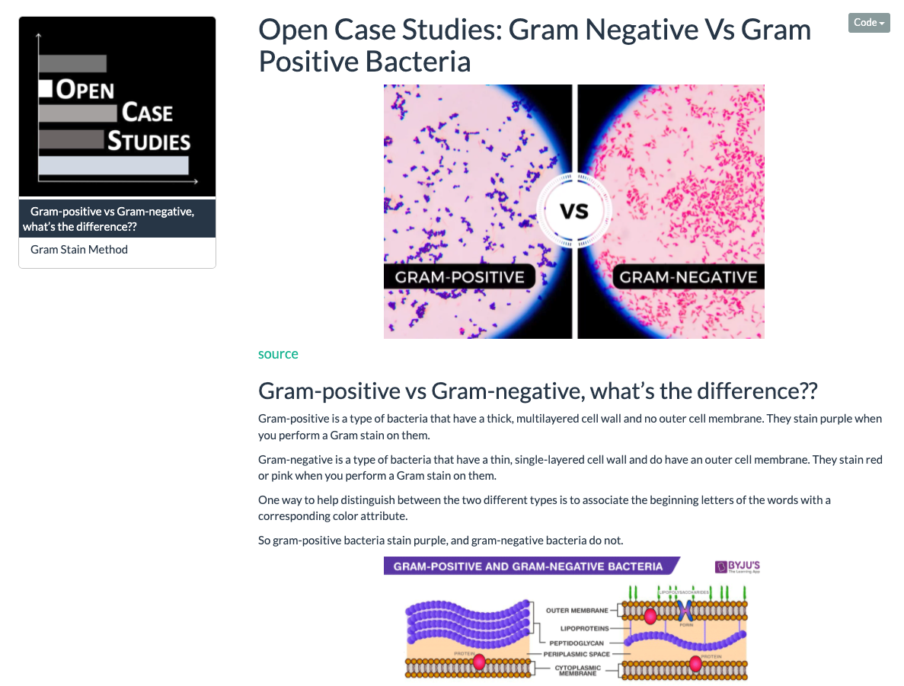

```{r setup, include=FALSE}
knitr::opts_chunk$set(echo = TRUE)
```

**Welcome to MakeCaseStudies! This web-app is here to help you create a case study. To create a case study, start by filling in the text boxes highlighted in red with the information you want to be included in the case study. In this format you can include a case study title, body text, headers, images, and a video. By default, these text boxes are filled in with the content from a case study on the Gram Stain method to act as an illustrative example. Provide links to images using the image URL and attach a video by inputting its YouTube video code.**






**Click the orange "Preview" tab (highlighted in red) in the top left to view what the case study in-progress looks like. Check this tab before downloading to ensure the final product looks as expected.**



**If you need more than the two sections provided by default, return to the "Create" tab and scroll to the bottom to find "insert" and "remove" buttons. Use the "Insert Header" and "Insert Narrative Section" buttons (highlighted in red) to add a new case study section with a header and text. The "remove" buttons are provided to remove any unused sections. Buttons to add more images and videos are not available at this time but they are under development.**



**Once satisfied with your case study, click on the download button at the top of the page labeled "Make Case Study." The button is highlighted in red. This will download an HTML file containing the case study. **






**Open the downloaded file (highlighted in red) named `my-report.html` to view the case study created. This file can be shared with students or hosted online. **

